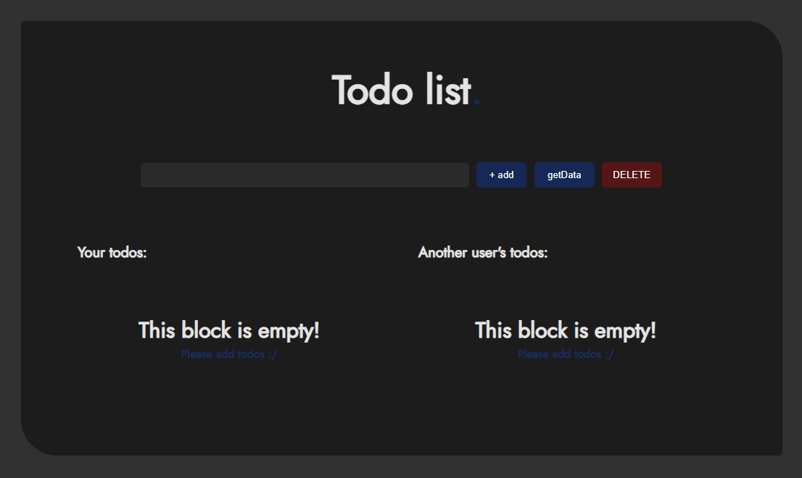
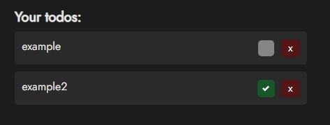
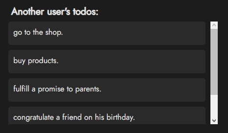
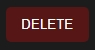

# TodoList

A regular Todo List with a request to the API and using several libraries:
- React
- React Hook Form
- Redux Toolkit + RTK Query
- JSON server + concurrently

## Usage

This `TodoList` uses two different blocks to display different data:

__First block:__

Displays user input data using `Redux Toolkit`.
Also you can interact with the data (remove/add toggle-effect)

__Second block:__

Displays data received from an API request using an `RTK Query`.
Unfortunately you can't interact with them :/

### Deletion

The DELETE button is used to completely clear the data.
It does not use the `method: DELETE` for the received data from the API request, but only “hides” them at the UI level!

